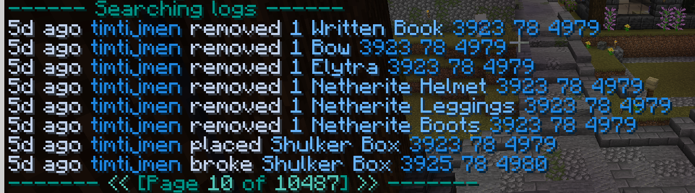

# Ledger

Ledger is a mod that logs many actions and interaction in the world, these actions can be rolled back by the mod as well.

---
Note: Ledger is a very powerfull tool which will do **exactly** what you tell it to do! If you say "rollback this area" without giving it a time, it will rollback that area to *from the begining of time*. If you dont put in a range or area, it will do the rollback *for the entire world.* So be very specific with what you ask it to do.

## Logs:
This is a log page. It shows the logs you have looked up. Most should be pretty self explanatory.

To read through the pages you can click the arrows at the bottom or use `/ledger page <page number>` to immediately skip to that page.

## Parameters
Parameters can be used to filter out what you want to search or roll back, they are used in almost all commands so its good to understand what they all do.

- `action` is the action that has been logged. For example `action:block-break` finds all blocks that were broken.
- `range` is the area you want to effect. Its selected as a square. 
- `source` is the source of the action. Which can be a player, entity or effect from the world.
  *Important info about `source`: If the source has a @ in front of it, that means it was done by a entity or world event.
  Example: `@creeper` means it was done by a creeper. `@gravity` means the block broke because the block it was hanging onto broke. (Signs, lantern, ect.) `@fluid` means the block was changed by either water or lave.*
- `after` means from x time ago to now, so `after:5m` means anything that happened from right now untill 5 minutes ago.
- `before` means before x time ago, so `before:5m` means anything that happened before 5 minutes ago.
- `object` is that thing that was effected, what items, what blocks or what entities you were looking for. Example `object:diamond` will look for logs with diamonds. 
- `world` is the world that you search in. Overworld, nether or end. If you leave this out it will default to the world your in.

## Commands:
- Inspect 

---
## Inspect
The inspect mode can be activated and deactivated with `/ledger inspect` or `/ledger i`.
This mode lets you read the logs of a specific block by left clicking on it. Or right click to check the logs of where you would place the block.

Command options:
- `/ledger inspect on/off` to specificly enable/disable inspect mode.
- `/ledger inspect <x> <y> <z>` to inspect a specific block.
---

## Search
